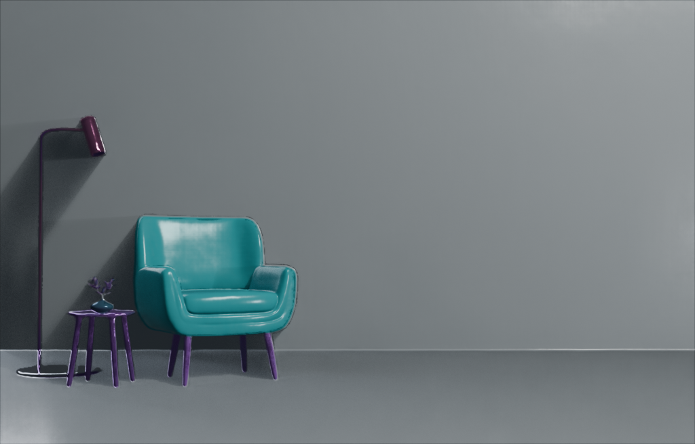

# VETI

Takes a photo and per-object segmentation masks, runs intrinsic decomposition + soft colour unmixing (FSCS/SCU), builds a MoGe depth mesh, and outputs a self-contained Blender scene with an editable colour palette and per-object material controls.

---
<p align="center">
  
  
</p>


<p align="left">
  <sub>&nbsp;&nbsp;&nbsp; <b>Input image</b> &nbsp;&nbsp;&nbsp;&nbsp;&nbsp;&nbsp;&nbsp;&nbsp;&nbsp;&nbsp;&nbsp;&nbsp;&nbsp;&nbsp;&nbsp;&nbsp;&nbsp;&nbsp;&nbsp;&nbsp; <b>Output image</b></sub>
</p>
## 1. Clone the repository 

The repo pulls `MoGe/` and `Intrinsic/` as git submodules — clone recursively, or init after cloning.

```bash
# one-shot
git clone --recurse-submodules git@github.com:ducang/VETI.git
cd VETI

# or, if you already cloned without submodules
git clone git@github.com:ducang/VETI.git
cd VETI
git submodule update --init --recursive
```

## 2. Set up environment

Tested with **Python 3.10 + CUDA 12.4 + PyTorch 2.5**. A CUDA-capable GPU is strongly recommended.

```bash
conda create -n veti python=3.10 -y
conda activate veti

# PyTorch matching CUDA 12.4
pip install torch==2.5.0 torchvision==0.20.0 --index-url https://download.pytorch.org/whl/cu124

# Project deps
pip install -r requirement.txt
```

Minimum runtime deps if you want to install by hand instead:

```
torch torchvision opencv-contrib-python numpy Pillow
```

and all required dependencies from the submodule packages.

## 3. Blender

Stage 2 of the pipeline drives Blender from the command line. Use **Blender 5.x** (4.0+ recommended; 3.x also works — the pipeline handles the Principled-BSDF socket rename automatically).

Download: https://www.blender.org/download/

**Make sure the `blender` executable is on your `PATH`** so that `blender --version` works in the same shell you run the pipeline from. If it isn't, add it:

Add the export line to your shell rc file (`~/.bashrc`, `~/.zshrc`) to make it persistent. Verify with:

```bash
blender --version
```

## 4. Input format

You need two things:

- **Image** — an RGB photo. 
- **Mask folder** — one `<object_name>_mask.png` (or `.jpg`) per object. Example:

  ```
  masks/image_02/
    ├── arms_mask.jpg
    ├── dress_mask.jpg
    ├── foot_mask.jpg
    ├── hair_mask.jpg
    └── bg_mask.jpg        # optional; inferred from the others if omitted
  ```

The repo ships sample inputs under [input_data/](input_data/).

## 5. Usage

### Stage 1 — run the pipeline

```bash
python pipeline_final.py \
    --img <path/to/image> \
    --mask_dir <path/to/masks> \
    --output_dir ./output
```

This produces an `output/` folder containing the decomposed albedo, palette layers, mesh (`mesh/scene.glb`), per-object masks, `materials.json`, `scene_config.json`, and a copy of `blender_palette.py`.

### Stage 2 — build the Blender scene

```bash
blender --background --python output/blender_palette.py -- --output_dir output
```

This writes `output/scene.blend` with the mesh, palette-driven colour nodes, and per-object material groups already wired up.

To tweak per-object roughness / metallic / specular, edit `output/materials.json` and re-run stage 2 — the `.blend` is rebuilt from scratch each time.

## 6. Example run

Using the provided [input_data/](input_data/) sample (image_02 has 4 labelled objects + background):

```bash
# Stage 1
python pipeline_final.py \
    --img input_data/images/image_11.jpg \
    --mask_dir input_data/mask/image_11 \
    --output_dir ./output/image_11

# Stage 2
blender --background --python output/image_11/blender_palette.py -- \
    --output_dir output/image_11
```

Open `output/image_11/scene.blend` in Blender to inspect or render.

In blender, select the mesh and go to Shader Editor to inspect color swatches and BRDF panels. Tweaking the these values provides live update in the render. It is recommended to view the blender scene in camera view under "rendered" option.

## 7. Key flags

| Flag | Default | Effect |
|------|---------|--------|
| `--tau` | 5.0 | Colour threshold — lower → more palette layers |
| `--min_vote` | 100 | Higher → fewer layers |
| `--min_eig_scu` | 5e-3 | SCU covariance floor; higher → less leaking |
| `--min_eig_rep` | 1e-3 | Rep covariance floor; lower → more colours |
| `--gf_eps` | 1e-2 | Guided-filter epsilon for colour-model estimation |
| `--moge_model` | `Ruicheng/moge-2-vitl-normal` | HuggingFace MoGe checkpoint |
| `--device` | `cuda` | Falls back to CPU if CUDA is unavailable |
| `--no_edge_cull` | off | Skip depth-edge masking on the mesh |
| `--fill_mask` | off | Use alpha mask without the valid-depth filter |
